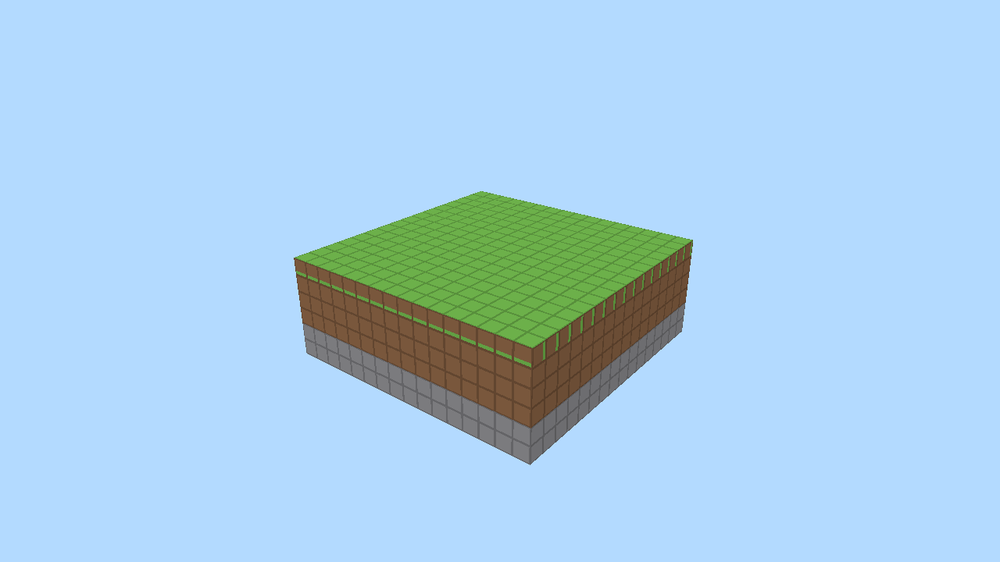

# Voxel Survival Game

A first-person voxel survival game built from scratch in modern **C++20** with
**Vulkan**. The long-term vision is a survival game on a single procedurally
generated island; this repository builds that foundation up in small, verifiable
milestones.

> **Status:** Milestone 1 complete — a textured, greedy-meshed 16×16×16 chunk
> rendered in 3D.



---

## Tech stack

| Concern            | Choice                                              |
|--------------------|-----------------------------------------------------|
| Language           | C++20                                               |
| Graphics API       | Vulkan                                              |
| Windowing / input  | GLFW                                                |
| Math               | GLM                                                 |
| Build system       | CMake (cross-platform: Windows, Linux, macOS)       |
| Dependencies       | Pulled automatically with CMake `FetchContent`      |

### Dependencies

These are downloaded and built automatically by CMake the first time you
configure — you do **not** need to install them by hand:

- [GLFW](https://github.com/glfw/glfw) 3.4 — windowing & input
- [GLM](https://github.com/g-truc/glm) 1.0.1 — math
- [Vulkan-Headers](https://github.com/KhronosGroup/Vulkan-Headers) (sdk-1.3.275) — Vulkan API headers

The only things you must provide yourself:

1. **A C++20 compiler** (GCC 11+, Clang 14+, or MSVC 2022).
2. **CMake 3.20+** and a generator (Ninja or Make on Linux/macOS, Visual Studio on Windows).
3. **The Vulkan runtime loader** — ships with every modern GPU driver. Installing
   the [Vulkan SDK](https://vulkan.lunarg.com/) is the easiest way to get it
   (and it also provides the validation layers used in Debug builds).

---

## Building

The project configures and builds with a single pair of commands on every
platform.

### Linux

Install a compiler, CMake, and the X11 development headers GLFW needs, then build:

```bash
# Debian/Ubuntu — system prerequisites
sudo apt install build-essential cmake ninja-build \
                 xorg-dev libxkbcommon-dev          # X11 headers for GLFW
# Vulkan loader + (optionally) validation layers:
sudo apt install libvulkan1 vulkan-validationlayers

# Configure & build
cmake -S . -B build -G Ninja -DCMAKE_BUILD_TYPE=Debug
cmake --build build -j

# Run
./build/bin/voxelgame
```

> GLFW is built against X11 by default here. To use the Wayland backend instead,
> install `wayland-protocols` + `libwayland-dev` and configure with
> `-DGLFW_BUILD_WAYLAND=ON`.

### Windows

Install [Visual Studio 2022](https://visualstudio.microsoft.com/) (with the
"Desktop development with C++" workload) and the
[Vulkan SDK](https://vulkan.lunarg.com/). Then:

```powershell
cmake -S . -B build
cmake --build build --config Debug

.\build\bin\Debug\voxelgame.exe
```

### macOS

Install the [Vulkan SDK](https://vulkan.lunarg.com/) (which includes MoltenVK,
the Vulkan-on-Metal translation layer) and a compiler/CMake (e.g. via Xcode
command-line tools + Homebrew):

```bash
brew install cmake ninja
cmake -S . -B build -G Ninja -DCMAKE_BUILD_TYPE=Debug
cmake --build build -j

./build/bin/voxelgame
```

---

## Running

Launch the executable from anywhere; it locates its `shaders/` and `assets/`
folders relative to its own location.

| Flag                | Meaning                                                  |
|---------------------|----------------------------------------------------------|
| `--frames N`        | Render `N` frames then exit (headless smoke-testing).    |
| `--screenshot PATH` | Render a few frames, write `PATH` as a PNG, then exit.   |

Milestone 1 renders a single hardcoded chunk (stone / dirt / grass layers) from
a fixed 3/4 view. Interactive camera controls arrive in Milestone 2.

In **Debug** builds the Vulkan validation layers are enabled automatically and
report warnings/errors to the console.

### Headless / CI testing

The project runs without a physical GPU using a virtual display and Mesa's
software Vulkan driver (lavapipe) — handy for CI:

```bash
sudo apt install xvfb mesa-vulkan-drivers vulkan-validationlayers
export VK_ICD_FILENAMES=/usr/share/vulkan/icd.d/lvp_icd.json
# Render a few frames and dump a screenshot to verify rendering end-to-end:
xvfb-run -a -s "-screen 0 1280x720x24" ./build/bin/voxelgame --screenshot out.png
```

---

## Project layout

```
src/
  core/      app, window, (input & timing later)
  render/    Vulkan: context, swapchain, renderer, pipeline, buffers,
             texture array, chunk renderer, screenshot
  world/     block, block registry, chunk, greedy mesher
  player/    camera, controller                   (Milestone 2)
shaders/     GLSL (chunk.vert/frag), compiled to SPIR-V at build time
assets/      textures/  (one solid-colour PNG per block face)
third_party/ vendored single-header libs (stb_image)
scripts/     gen_textures.py (regenerates the placeholder textures)
```

Vulkan setup is split into focused, RAII-wrapped classes
(`VulkanContext`, `Swapchain`, `Renderer`, `Pipeline`, `Buffer`,
`TextureArray`, …) rather than one giant file, so each stage is readable on its
own.

### How the rendering works (Milestone 1)

- **Greedy meshing** (`world/ChunkMesher`) merges adjacent coplanar faces of the
  same block type into large quads, and only emits faces where a solid block
  borders a non-opaque one (built-in face culling).
- Because a merged quad spans many blocks, a naive atlas would *stretch* the
  texture across it. Instead we use a **Vulkan texture array**
  (`VK_IMAGE_VIEW_TYPE_2D_ARRAY`) and express UVs in **block units** with a
  **REPEAT** sampler, so each block shows one full texture tile.
- A **block registry** (`world/BlockRegistry`) is the single source of truth for
  block properties and per-face texture layers, and is trivial to extend.

---

## Roadmap

- [x] **Milestone 0** — Project skeleton: window + Vulkan + clear screen.
- [x] **Milestone 1** — Render one greedy-meshed, textured chunk.
- [ ] **Milestone 2** — First-person camera, walking + collision, free-fly.
- [ ] **Milestone 3** — Procedural multi-chunk noise terrain.

See [`FUTURE.md`](FUTURE.md) for documented extension points for deferred
features (inventory, crafting, mobs, custom block models, island shaping, …).
